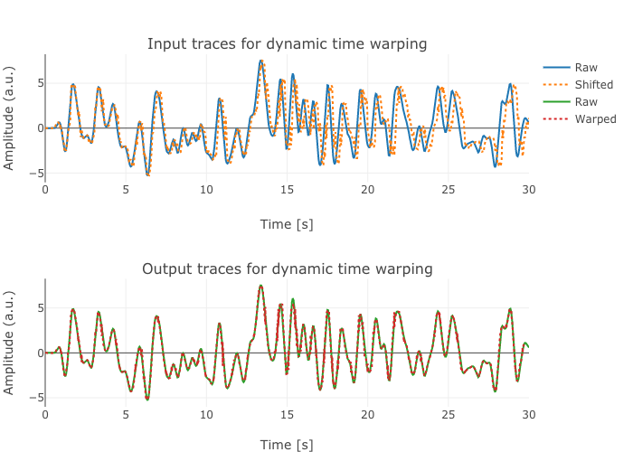
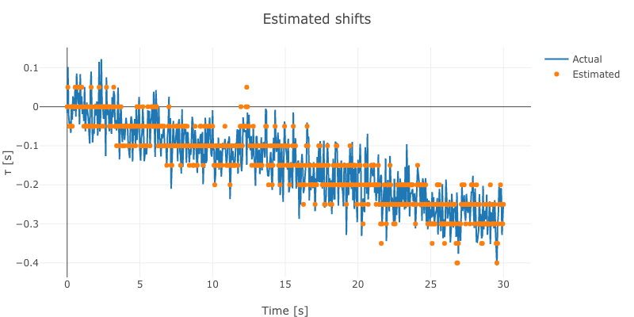
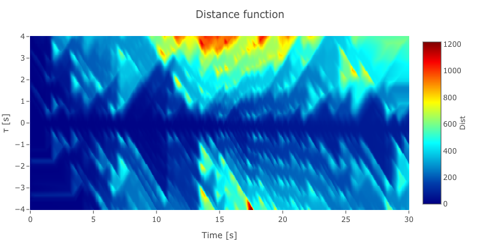
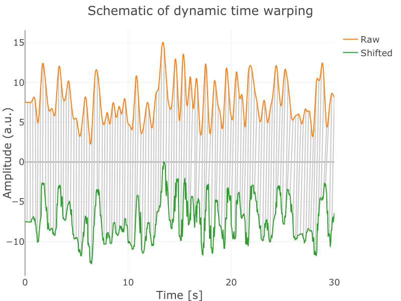
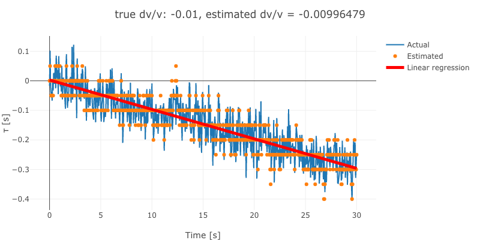
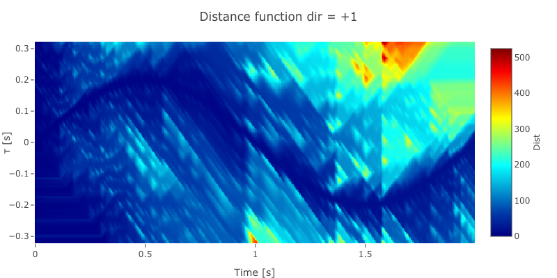
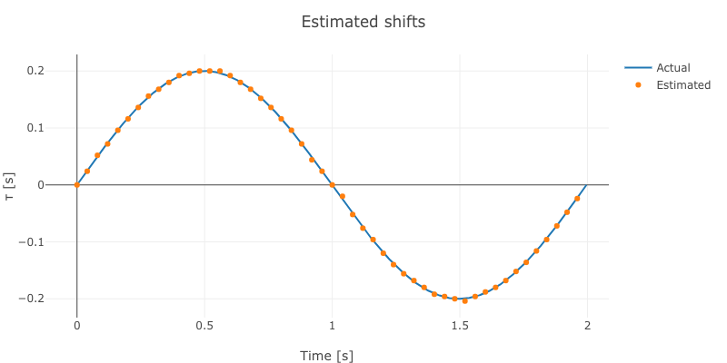

# Sample Results

## example\_stretchedData.jl
Example case for time shift analysis of stretched time series.

The input data is time shifted by dv/v = -0.01 + Random noise on time shift function s(t).

> Other parameters:
dt = 0.05 [s], peak frequency of convolved Ricker wavelet = 1.0 [Hz], duration = 30[s]

Blue line shows the pre-described s(t) and  orange dots indicate the estimated time shift.

Color contour shows the distance between two signals associated with corresponding time lag τ. Distance array shows the saddle point of cost function, which provides most likely time shift at each time.

This shows a schematic of dynamic time warping. Grey lines shows the corresponding points of time shift using the distance array above.

Finally, the estimated dv/v by linear regression of estimated time shift is in agreement with the prescribed value.

## DTWDT\_run\_example.jl
DTW Distance Array:

Comparison of time shift function s(t):

Raw, shifted and warped traces from DTW distance function:

